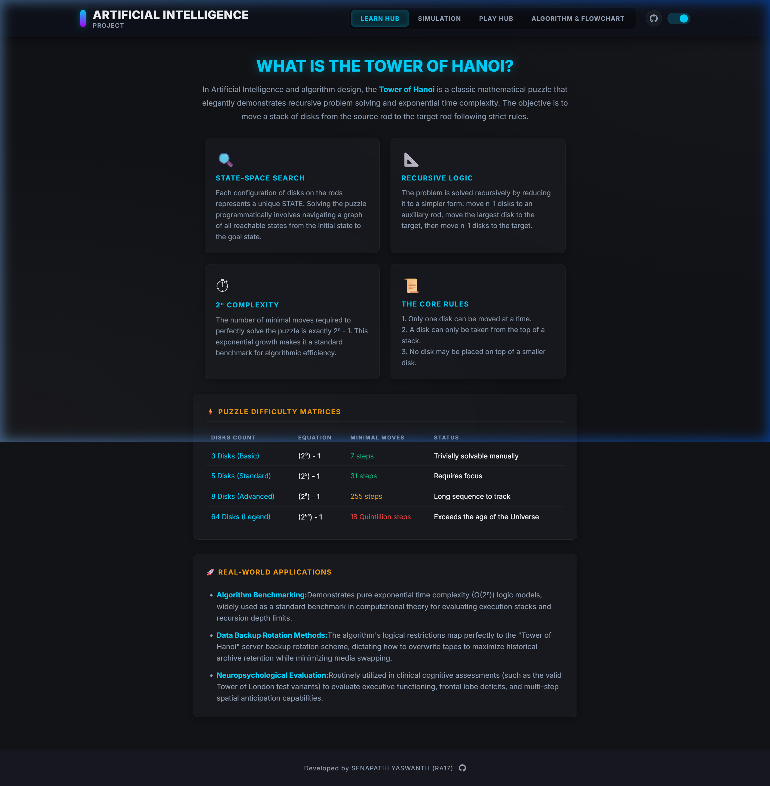
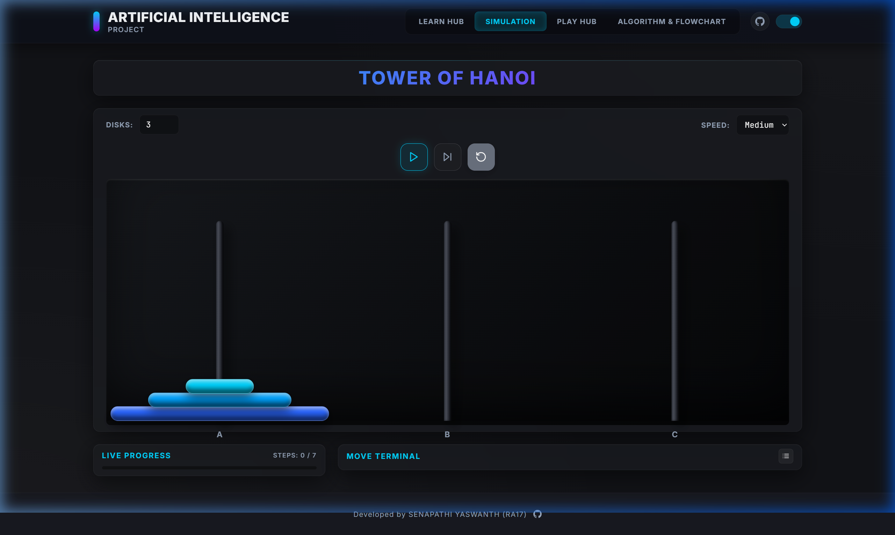
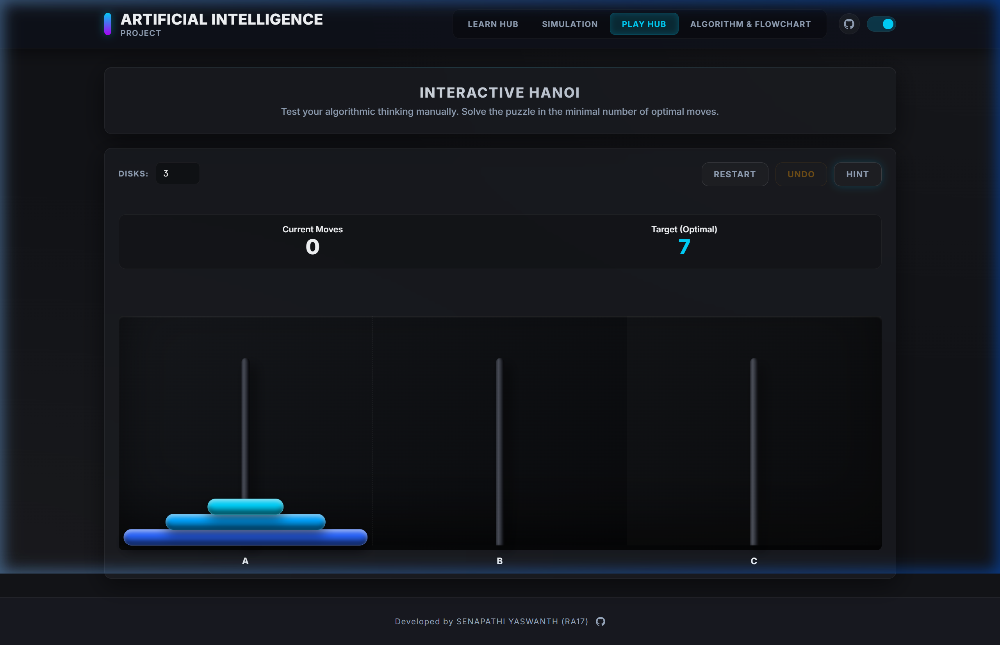
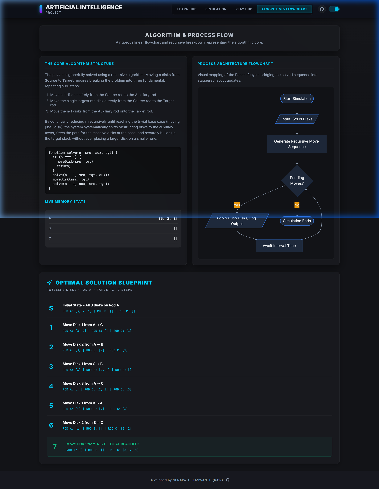

<div align="center">


<br/><br/>

# 🗼 Tower of Hanoi — AI Simulation Platform

**An advanced, interactive Tower of Hanoi simulation built with React 19 + Vite.**  
Featuring recursive algorithm visualization, step-by-step solution blueprints, an interactive play mode with BFS-powered hints, and a full-screen cyberpunk neon UI.

<br/>

### 🔗 [**Live Demo → tower-of-hanoi-ai.vercel.app**](https://tower-of-hanoi-ai.vercel.app)

<br/>

_Developed by **SENAPATHI YASWANTH (RA17)**_  
[](https://github.com/senapathiyaswanth/)

</div>

---

## 📸 Screenshots

### 🏠 Learn Hub — Theory & Concept Cards


> The **Learn Hub** presents the foundational AI concepts behind the Tower of Hanoi — State-Space Search, Recursive Logic, 2ⁿ Complexity, and the Core Rules — through interactive glassmorphic concept cards. A detailed Puzzle Difficulty Matrix and Real-World Applications section round out the educational content.

---

### ⚡ Simulation — Auto-Solver Visualizer


> The **Simulation tab** is the core engine. Adjust the disk count (2–8), set speed (Slow / Medium / Fast), and watch the recursive algorithm solve the puzzle in real time. Each disk animates with fluid CSS transitions, colour-coded from cyan to neon purple. Live Progress tracking and a Move Terminal log every step.

---

### 🎮 Play Hub — Interactive Puzzle Mode


> The **Play Hub** lets you solve the puzzle manually by clicking rods to pick up and place disks. An Undo button reverts bad moves. When you need help, the **Hint** button uses a BFS path-finding algorithm to calculate the single best next move in your current state and display it in plain English.

---

### 🔬 Algorithm & Flowchart — Process Architecture


> The **Algorithm & Flowchart tab** provides a rigorous breakdown of the recursive solve logic with a live code block, a Mermaid.js-rendered process flowchart, a Live Memory State panel showing rod contents in real time, and a **dynamically computed Optimal Solution Blueprint** that recalculates every step when you change the disk count.

---

## ✨ Features

| Feature | Description |
|---|---|
| 🧠 **Recursive Solver** | Pre-generates all `2ⁿ - 1` moves, then replays them at selected speed |
| ▶ **Play / Pause / Step** | Full playback control — run to completion or advance one move at a time |
| 🎮 **Interactive Mode** | Click-to-move gameplay with invalid-move detection and visual disk lift animation |
| 💡 **BFS-Powered Hints** | Calculates the optimal next move from your current game state using Breadth-First Search |
| ↩ **Undo System** | Full move history stack — undo any number of moves without restarting |
| 📊 **Live Progress Bar** | Visual progress tracker showing current step / total moves |
| 🖥 **Move Terminal** | Real-time log of every disk movement with step numbers |
| 📐 **Dynamic Blueprint** | Algorithm tab blueprint auto-regenerates for any disk count |
| 🌊 **Mermaid Flowchart** | Interactive process architecture diagram rendered via Mermaid.js |
| 🔊 **Sound Effects** | Subtle Web Audio API beep on each disk move |
| 🌗 **Dark / Light Theme** | Persistent theme toggle stored in LocalStorage |
| 🔗 **GitHub Link** | Header & footer GitHub icon linking directly to the developer's profile |

---

## 🧮 The Algorithm

The Tower of Hanoi is solved using a **divide-and-conquer recursive algorithm**:

```
function solve(n, source, auxiliary, target):
  if n == 1:
    move disk from source to target
    return
  solve(n - 1, source, target, auxiliary)   // Step 1: Move n-1 disks out of the way
  move disk n from source to target          // Step 2: Move the largest disk
  solve(n - 1, auxiliary, source, target)   // Step 3: Move n-1 disks onto target
```

### Time Complexity

| Disks (n) | Formula | Moves Required |
|---|---|---|
| 3 | 2³ − 1 | **7** |
| 5 | 2⁵ − 1 | **31** |
| 8 | 2⁸ − 1 | **255** |
| 64 | 2⁶⁴ − 1 | **~18 Quintillion** |

**Time Complexity: O(2ⁿ)** — This exponential growth makes it one of the canonical benchmarks for measuring recursive algorithm efficiency.

---

## 🗂 Project Structure

```
tower-of-hanoi-ai/
├── public/
│   ├── favicon.svg
│   └── icons.svg
├── screenshots/              # README screenshots
│   ├── learn-hub.png
│   ├── simulation.png
│   ├── play-hub.png
│   └── algorithm.png
├── src/
│   ├── hooks/
│   │   └── useHanoi.js       # Core game engine (state, solver, audio)
│   ├── components/
│   │   ├── Board.jsx          # Animated disk/rod SVG board
│   │   ├── ConceptHub.jsx     # Learn Hub theory content
│   │   ├── PlayTab.jsx        # Interactive play mode + hint/undo
│   │   └── AlgorithmFlowchartTab.jsx  # Mermaid flowchart + dynamic blueprint
│   ├── App.jsx                # Root app shell, routing, GitHub icon
│   ├── index.css              # Global cyberpunk design system
│   └── main.jsx               # React DOM entry point
├── index.html
├── vite.config.js
├── package.json
├── LICENSE
└── README.md
```

---

## 🚀 Getting Started

### Prerequisites

- **Node.js** ≥ 18.x
- **npm** ≥ 9.x

### Installation & Development

```bash
# 1. Clone the repository
git clone https://github.com/senapathiyaswanth/tower-of-hanoi-ai.git

# 2. Navigate into the project
cd tower-of-hanoi-ai

# 3. Install dependencies
npm install

# 4. Start the development server
npm run dev
```

Open **[http://localhost:5173](http://localhost:5173)** in your browser.

### Production Build

```bash
# Build for production
npm run build

# Preview the production build locally
npm run preview
```

The built output is in the `dist/` directory, ready for deployment on any static host.

---

## 🛠 Tech Stack

| Technology | Purpose |
|---|---|
| **React 19** | UI component architecture |
| **Vite 8** | Lightning-fast build tooling and dev server |
| **JavaScript (ESM)** | Application logic |
| **Mermaid.js** | Algorithmic process flowchart rendering |
| **Web Audio API** | Sound effects for disk moves |
| **CSS Custom Properties** | Cyberpunk neon design system with dark/light themes |
| **Vercel** | Production deployment and CDN |

---

## 🌐 Deployment

This project is deployed on **Vercel** with automatic production builds triggered on every push to the `master` branch.

| Environment | URL |
|---|---|
| **Production** | [tower-of-hanoi-ai.vercel.app](https://tower-of-hanoi-ai.vercel.app) |
| **Repository** | [github.com/senapathiyaswanth/tower-of-hanoi-ai](https://github.com/senapathiyaswanth/tower-of-hanoi-ai) |

---

## 📜 License

This project is open source and available under the **MIT License**.

```
MIT License

Copyright (c) 2026 SENAPATHI YASWANTH

Permission is hereby granted, free of charge, to any person obtaining a copy
of this software and associated documentation files (the "Software"), to deal
in the Software without restriction, including without limitation the rights
to use, copy, modify, merge, publish, distribute, sublicense, and/or sell
copies of the Software, and to permit persons to whom the Software is
furnished to do so, subject to the following conditions:

The above copyright notice and this permission notice shall be included in all
copies or substantial portions of the Software.

THE SOFTWARE IS PROVIDED "AS IS", WITHOUT WARRANTY OF ANY KIND, EXPRESS OR
IMPLIED, INCLUDING BUT NOT LIMITED TO THE WARRANTIES OF MERCHANTABILITY,
FITNESS FOR A PARTICULAR PURPOSE AND NONINFRINGEMENT. IN NO EVENT SHALL THE
AUTHORS OR COPYRIGHT HOLDERS BE LIABLE FOR ANY CLAIM, DAMAGES OR OTHER
LIABILITY, WHETHER IN AN ACTION OF CONTRACT, TORT OR OTHERWISE, ARISING FROM,
OUT OF OR IN CONNECTION WITH THE SOFTWARE OR THE USE OR OTHER DEALINGS IN THE
SOFTWARE.
```

See the [LICENSE](./LICENSE) file for full details.

---

## 👨‍💻 Credits & Attribution

<div align="center">

| Role | Name |
|---|---|
| **Developer & Designer** | SENAPATHI YASWANTH (RA17) |
| **Project Type** | Artificial Intelligence — Academic Project |
| **Algorithm** | Tower of Hanoi Recursive Solver |
| **UI Framework** | React 19 + Vite 8 |
| **Deployment** | Vercel |

<br/>

[](https://github.com/senapathiyaswanth/)

<br/>

**Built with ❤️ and neon-cyberpunk energy.**

</div>

---

<div align="center">
  <sub>© 2026 SENAPATHI YASWANTH — Open Source under the MIT License</sub>
</div>
